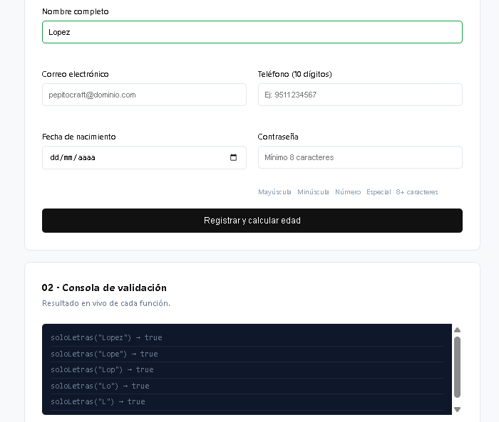
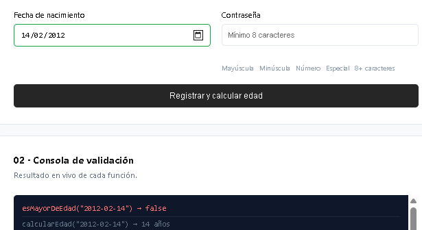
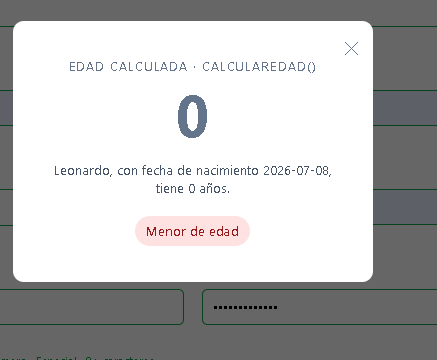

# Utilería.js

Alumno: Martinez Miguel Leonardo Daniel
Profesora: Martinez Nieto Adelina

## Problema que resuelve

Esta librería evita que el desarrollador pierda tiempo escribiendo desde cero las mismas validaciones en cada formulario nuevo. Proporciona funciones listas para usarse que revisan el formato de correos, verifican la seguridad de contraseñas, calculan edades y comparan textos, manteniendo el archivo principal limpio y estructurado.

## Instalación

Para implementar la librería en tu proyecto, solo debes vincular el archivo al final de tu documento HTML, justo antes de cerrar la etiqueta del cuerpo de la página:

```html
<script src="utileria.js"></script>
```

## Uso

A continuación se muestra cómo llamar a las funciones de la librería dentro de la lógica de tu aplicación.

Para verificar si un correo tiene la estructura adecuada:

```javascript
const correoIngresado = "usuario@dominio.com";
const correoValido = Utileria.validarCorreo(correoIngresado);

if (correoValido) {
    console.log("El formato es correcto");
}
```

Para calcular la edad exacta partiendo de una fecha de nacimiento:

```javascript
const fecha = "2004-04-12";
const edad = Utileria.calcularEdad(fecha);

console.log("La edad calculada es: " + edad);
```

Para confirmar que una contraseña cumpla con los niveles de seguridad y coincida con su confirmación:

```javascript
const pass1 = "ContraSegura123!";
const pass2 = "ContraSegura123!";

const esSegura = Utileria.validarPassword(pass1);
const coinciden = Utileria.validarTextosIguales(pass1, pass2);
```

## Capturas de pantalla

Resultados de la librería en acción, validando datos en tiempo real y mostrando el cálculo final.

### 1. Formulario de Registro

Cada campo se valida al instante conforme el usuario escribe, encendiendo los bordes en verde o rojo.



### 2. Pantalla de Login

Acceso protegido reutilizando las herramientas de la librería.



### 3. Ventana Modal (Cálculo de Edad)

Al enviar el formulario correctamente, se calcula la edad exacta y se determina si el usuario es mayor o menor de edad.



## Video

> **Nota:** Se actualizó el enlace el día de hoy ya que el video original sufrió un error de procesamiento en la plataforma y quedó corrupto.

Enlace al video: [https://www.youtube.com/watch?v=s4ILzb6us_Q](https://www.youtube.com/watch?v=s4ILzb6us_Q)
